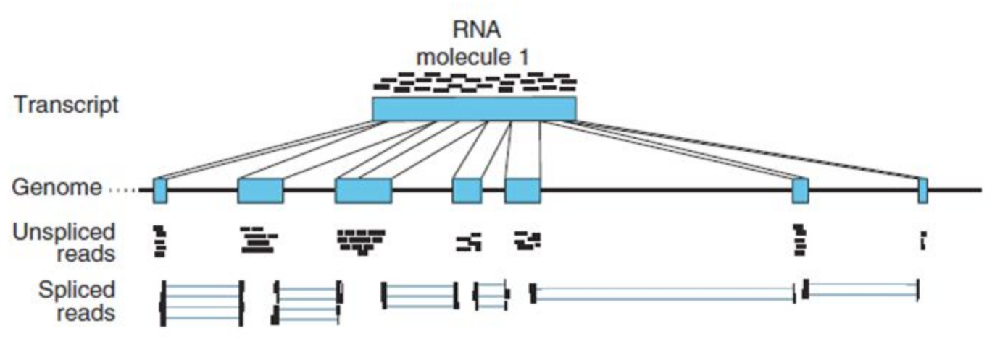

# Contents
[Exercise 1](#1)  
[Exercise 2](#2)    
[Exercise 3](#3)  


## Exercise 1 - Quality assessment of sequence data <a name="1"></a>
First log onto Freebee and create a directory called `transcriptomics` and go inside it.

### Get data

Download _one_ of the fastq-samples (they come in pairs, forward and reverse) from [here](http://folk.uio.no/jonbra/MBV-INF4410_2017/Transcriptomics/)  
For example:

```
wget http://folk.uio.no/jonbra/MBV-INF4410_2017/Transcriptomics/aboral-1_R1.fastq.gz  
wget http://folk.uio.no/jonbra/MBV-INF4410_2017/Transcriptomics/aboral-1_R2.fastq.gz
```
These are paired-end sequences (usually named R1 and R2). Most programs require that these files contains the same number of reads, and that they are sorted in the same order. Any idea how we can check this?  

Let's first count the number of sequences:

```
# We use zcat to print the contents of a gzipped file to screen, and then we pipe it directly into the wc command
zcat aboral-1_R1.fastq.gz | wc -l
zcat aboral-1_R2.fastq.gz | wc -l
```
How many sequences are there in the two files? (remember that a sequence in .fastq-format covers four lines). Do both files contain the same number?

Another way to do this is to count the number of `@` characters in each file, because each sequence in a `.fastq` begins with an `@`:
```
zcat aboral-1_R1.fastq.gz | grep -c "^@"
```

`grep` is a very useful command used to extract lines of files matching different patterns and do stuff with these lines. Such as in this case count the nuber of lines beginning with @.

But we should also check that the sequences come in the same order in the two files, i. e. that sequences from the same pair are at the same place: 

```
zcat aboral-1_R1.fastq.gz | grep "^@" | head
```
```
# @NS500336:69:H5KLLAFXX:1:11101:19827:1048 1:N:0:CGCTCATT+NTTCGCCT
# @NS500336:69:H5KLLAFXX:1:11101:10714:1050 1:N:0:CGCTCATT+NTTCGCCT
# @NS500336:69:H5KLLAFXX:1:11101:8501:1050 1:N:0:CGCTCATT+NTTCGCCT
# @NS500336:69:H5KLLAFXX:1:11101:20889:1050 1:N:0:CGCTCATT+NTTCGCCT
# @NS500336:69:H5KLLAFXX:1:11101:3254:1050 1:N:0:CGCTCATT+NTTCGCCT
# @NS500336:69:H5KLLAFXX:1:11101:23010:1051 1:N:0:CGCTCATT+NTTCGCCT
# @NS500336:69:H5KLLAFXX:1:11101:7060:1053 1:N:0:CGCTCATT+NTTCGCCT
# @NS500336:69:H5KLLAFXX:1:11101:4582:1055 1:N:0:CGCTCATT+NTTCGCCT
# @NS500336:69:H5KLLAFXX:1:11101:8956:1056 1:N:0:CGCTCATT+NTTCGCCT
# @NS500336:69:H5KLLAFXX:1:11101:20748:1057 1:N:0:CGCTCATT+NTTCGCCT
```
```
zcat aboral-1_R2.fastq.gz | grep "^@" | head
```
```
# @NS500336:69:H5KLLAFXX:1:11101:19827:1048 2:N:0:CGCTCATT+NTTCGCCT
# @NS500336:69:H5KLLAFXX:1:11101:10714:1050 2:N:0:CGCTCATT+NTTCGCCT
# @NS500336:69:H5KLLAFXX:1:11101:8501:1050 2:N:0:CGCTCATT+NTTCGCCT
# @NS500336:69:H5KLLAFXX:1:11101:20889:1050 2:N:0:CGCTCATT+NTTCGCCT
# @NS500336:69:H5KLLAFXX:1:11101:3254:1050 2:N:0:CGCTCATT+NTTCGCCT
# @NS500336:69:H5KLLAFXX:1:11101:23010:1051 2:N:0:CGCTCATT+NTTCGCCT
# @NS500336:69:H5KLLAFXX:1:11101:7060:1053 2:N:0:CGCTCATT+NTTCGCCT
# @NS500336:69:H5KLLAFXX:1:11101:4582:1055 2:N:0:CGCTCATT+NTTCGCCT
# @NS500336:69:H5KLLAFXX:1:11101:8956:1056 2:N:0:CGCTCATT+NTTCGCCT
# @NS500336:69:H5KLLAFXX:1:11101:20748:1057 2:N:0:CGCTCATT+NTTCGCCT
```
What does these commands do?

Notice that the names of each read are the same in both files, except the number "1" or "2" which indicates the first and second read of each pair. We didn't check all the sequences, but I'm pretty confident that these files are ok!  


### Quality check  
To inspect the reads and visualize the quality, run FastQC:  

```
module load fastqc
fastqc *.gz
```  

Download the `.html` files to your local computer and look at them in a web browser.  
- How long are the reads?
- How does the quality look like? Are there any differences in the quality score between the R1 and the R2 files?
- Are there any leftover sequencing adapters?

### Trimming  
We trim the reads using [Trim Galore](http://www.bioinformatics.babraham.ac.uk/projects/trim_galore/). Default settings is to trim nucleotides lower than phred score 20 and looks for standard Illumina sequencing adapters. The option `--paired` tells the program to expect two files of paired reads, and `--fastqc` tells it to run FastQC on the trimmed reads. The job takes a couple of minutes.

```
# First we check which versions of the program are available on Abel
module avail trim-galore

# We use the latest version
module load trim-galore/0.4.4

trim_galore --fastqc --paired R1-file R2-file
```
Inspect the trimming reports in the terminal (remember how to view files in Unix?).  
- Were any reads trimmed? 
- Were there any reads with sequencing adapters?  

Download the fastqc reports of the trimmed reads and look at them in the browser. Notice any differences compared to the untrimmed reads?

[Top](#contents)
# Exercise 2 - Mapping  <a name="2"></a>
Now we are ready to map the reads to the genome and count the gene expression. Download this file which contains the _Mnemiopsis leidyi_ genome and transcriptome (in addition to a few index files which we'll need later):

`wget http://folk.uio.no/jonbra/MBV-INF4410_2017/Transcriptomics/genome_transcriptome.tar`

and unpack it with:
`tar -xvf genome_transcriptome.tar`  

We use TopHat2 to map the trimmed reads to the genome. Tophat first tries to map the entire read to the genome. Then, for the reads that do not map it splits them into shorter pieces and tries to map those. In this way, reads which spans introns can be mapped. This will also generate information about how where exons and introns are and if any transcripts are alternatively spliced.   

  

The mapping takes about 10 min so you can take a break (but check the first minute that there are no errors!). Run the following commands:  

```
module load tophat/2.1.1
module load bowtie2/2.2.9 # bowtie2 is the actual mapper
module load samtools/1.3.1 # needed to process files

tophat -G genome_transcriptome/ML2.2.nogene.gff3 -p 8 --library-type fr-firststrand genome_transcriptome/Ml_genome trimmed_R1_file trimmed_R2_file &
```
  
You should now have a file called `accepted_hits.bam` inside the `tophat_out` directory. .bam is a compressed version of the .sam format we met in the variant calling lecture. .sam files are often huge and are therefore usually compressed. `samtools` is a program designed to work on sam/bam files. Let's have a quick look at the mapping file:  

```
samtools view tophat_out/accepted_hits.bam | head
```
```
NS500336:69:H5KLLAFXX:1:21103:15566:3632	321	ML0001	1199	0	76M	ML0040	2046	0	GGGGTATAGACGCCAAACTCTGTTAAACTCTCCCATTTTGTGCAACTTATAACGAGAGAACCATACATAGTTGGGC	AAAAAEEEEEEEEEEEEEEEEEEEEEEEEEEEEEEEEEEEEEEEEEEEEEEEEEEEEEEEEEEEEEEEEEEEEEEE	AS:i:0	XN:i:0	XM:i:0	XO:i:0	XG:i:0	NM:i:0	MD:Z:76	YT:Z:UU	NH:i:14	CC:Z:ML2169	CP:i:116107	XS:A:-	HI:i:0
NS500336:69:H5KLLAFXX:1:21103:15566:3632	97	ML0001	1199	0	76M	ML0292	459	0	GGGGTATAGACGCCAAACTCTGTTAAACTCTCCCATTTTGTGCAACTTATAACGAGAGAACCATACATAGTTGGGC	AAAAAEEEEEEEEEEEEEEEEEEEEEEEEEEEEEEEEEEEEEEEEEEEEEEEEEEEEEEEEEEEEEEEEEEEEEEE	AS:i:0	XN:i:0	XM:i:0	XO:i:0	XG:i:0	NM:i:0	MD:Z:76	YT:Z:UU	NH:i:14	CC:Z:ML2169	CP:i:116107	XS:A:-	HI:i:2
NS500336:69:H5KLLAFXX:1:21103:15566:3632	321	ML0001	1199	0	76M	ML0305	3201	0	GGGGTATAGACGCCAAACTCTGTTAAACTCTCCCATTTTGTGCAACTTATAACGAGAGAACCATACATAGTTGGGC	AAAAAEEEEEEEEEEEEEEEEEEEEEEEEEEEEEEEEEEEEEEEEEEEEEEEEEEEEEEEEEEEEEEEEEEEEEEE	AS:i:0	XN:i:0	XM:i:0	XO:i:0	XG:i:0	NM:i:0	MD:Z:76	YT:Z:UU	NH:i:14	CC:Z:ML2169	CP:i:116107	XS:A:-	HI:i:4
NS500336:69:H5KLLAFXX:1:21103:15566:3632	321	ML0001	1199	0	76M	ML0474	6308	0	GGGGTATAGACGCCAAACTCTGTTAAACTCTCCCATTTTGTGCAACTTATAACGAGAGAACCATACATAGTTGGGC	AAAAAEEEEEEEEEEEEEEEEEEEEEEEEEEEEEEEEEEEEEEEEEEEEEEEEEEEEEEEEEEEEEEEEEEEEEEE	AS:i:0	XN:i:0	XM:i:0	XO:i:0	XG:i:0	NM:i:0	MD:Z:76	YT:Z:UU	NH:i:14	CC:Z:ML2169	CP:i:116107	XS:A:-	HI:i:6
NS500336:69:H5KLLAFXX:1:21103:15566:3632	321	ML0001	1199	0	76M	ML1670	579998	0	GGGGTATAGACGCCAAACTCTGTTAAACTCTCCCATTTTGTGCAACTTATAACGAGAGAACCATACATAGTTGGGC	AAAAAEEEEEEEEEEEEEEEEEEEEEEEEEEEEEEEEEEEEEEEEEEEEEEEEEEEEEEEEEEEEEEEEEEEEEEE	AS:i:0	XN:i:0	XM:i:0	XO:i:0	XG:i:0	NM:i:0	MD:Z:76	YT:Z:UU	NH:i:14	CC:Z:ML2169	CP:i:116107	XS:A:-	HI:i:8
NS500336:69:H5KLLAFXX:1:21103:15566:3632	321	ML0001	1199	0	76M	ML2441	20	0	GGGGTATAGACGCCAAACTCTGTTAAACTCTCCCATTTTGTGCAACTTATAACGAGAGAACCATACATAGTTGGGC	AAAAAEEEEEEEEEEEEEEEEEEEEEEEEEEEEEEEEEEEEEEEEEEEEEEEEEEEEEEEEEEEEEEEEEEEEEEE	AS:i:0	XN:i:0	XM:i:0	XO:i:0	XG:i:0	NM:i:0	MD:Z:76	YT:Z:UU	NH:i:14	CC:Z:ML2169	CP:i:116107	XS:A:-	HI:i:10
NS500336:69:H5KLLAFXX:1:21103:15566:3632	353	ML0001	1199	0	76M	ML5057	984	0	GGGGTATAGACGCCAAACTCTGTTAAACTCTCCCATTTTGTGCAACTTATAACGAGAGAACCATACATAGTTGGGC	AAAAAEEEEEEEEEEEEEEEEEEEEEEEEEEEEEEEEEEEEEEEEEEEEEEEEEEEEEEEEEEEEEEEEEEEEEEE	AS:i:0	XN:i:0	XM:i:0	XO:i:0	XG:i:0	NM:i:0	MD:Z:76	YT:Z:UU	NH:i:14	CC:Z:ML2169	CP:i:116107	XS:A:-	HI:i:12
NS500336:69:H5KLLAFXX:1:11310:21784:8226	99	ML0001	1200	50	76M	=	1233	109	GGGTATAGACGCCAAACTCTGTTAAACTCTCCCATTTTGTGCAACTTATAACAAGAGAACCATACATAGTTGGGCT	AAAAAEEEEEEEEEEEEEEEEEEEEEEEEEEEEEEEEEEEEEEEEEEEEEEEEEEEEEEEEEEEEEEEEEEEEEEE	AS:i:-5	XN:i:0	XM:i:1	XO:i:0	XG:i:0	NM:i:1	MD:Z:52G23	YT:Z:UU	NH:i:1	XS:A:-
NS500336:69:H5KLLAFXX:1:11310:21784:8226	147	ML0001	1233	50	76M	=	1200	-109	ATTTTGTGCAACTTATAACAAGAGAACCATACATAGTTGGGCTTAAAACGACCTAGGGTCTAAAAGATAATCGTTT	EEEEEEEEEEEEEAEAEEEEEEEEEEEEEAEEEEEEEEEEEEEEEEEEEEEEEEEEEEEEEEEEEEEEEEEAAAAA	AS:i:-5	XN:i:0	XM:i:1	XO:i:0	XG:i:0	NM:i:1	MD:Z:19G56	YT:Z:UU	NH:i:1	XS:A:-
NS500336:69:H5KLLAFXX:1:21104:22111:1981	153	ML0001	1272	3	76M	*	0	0	GGCTTAAAACGACCTAGGGTCTAAAAGATAATCGTTTGGGGCGTGCTTTAGGCTAGGTCTCATTTCAAAATATTAA	EEEEEEEEEEEEEEEEEEEEEAEEEEEEEEEEEEEEEEEEEEEEEEEEEEEEEEEEEEEEEEEEEEEEEEAAAAAA	AS:i:0	XN:i:0	XM:i:0	XO:i:0	XG:i:0	NM:i:0	MD:Z:76	YT:Z:UU	NH:i:2	CC:Z:ML2478	CP:i:987	XS:A:-	HI:i:0

```

The file contains all the informatio about which reads map to which reads in the genome, how many mismathces there are, the quality of the reads, where the other paired read has mapped, etc.  
### Inspecting the .bam file in IGV
Download `accepted_hits.bam`, `MlScaffold09.nt` (the genome) and `ML2.2.nogene.gff3` (the gene annotation) to your local computer. First load the genome into IGV. Use IGVTools (Tools -> Run igvtools) to first sort the `.bam file` (Command sort) and then index the sorted file (Command Index).

Play around a little in IGV. Do you see the mapped reads? Do you see any spliced reads? Does the read mapping match the annotated exons? It is always useful to inspect mapping files in IGV to get a feel for the data. 


[Top](#contents)
# Exercise 3 - Counting gene expression <a name="3"></a>

Now we need to count the expression of each gene in the annotation file. First, we will sort the mapping file again (same as we did in IGV, but on Freebee this time). Remember to load samtools if you haven't:

`samtools sort -O bam -T tmp -n tophat_out/accepted_hits.bam -o tophat_out/accepted_hits_sorted.bam` (takes 1-2 min).

We use a program called HTSeq to do the counting. In the default mode (union) it counts a read if it fully, or partially, overlaps an annotated region.   

  

```
module load python2
pip install --user HTSeq

python -m HTSeq.scripts.count -f bam -r name -s reverse -t mRNA -i ID tophat_out/accepted_hits_sorted.bam genome_transcriptome/ML2.2.nogene.gff3 > sample-name.txt
```
Takes about 5 min. Here we specified that the input file is a .bam file (`-f bam`), the bam file is sorted according to the names of the reads (`-r name`), the reads are strand-specific (i. e. we know which of the DNA-strands they originate from, hence the direction of transcription (`-s reverse`. Reverse referred to the way the sequencing library was sequenced). `-t` tells which feature of the .gff3 file to be counted (you can also count individual exons or any other field), `-i` which name to be given to the feature.  
  
Try to type this if you get an error:

```
unset LC_CTYPE
unset LANG
```
You should have a file which looks something like this:  

```
ML000110a	7  
ML000111a	0
ML000112a	0
ML000113a	32
ML000114a	17
ML000115a	50
ML000116a	33
ML000117a	23
ML000118a	14
ML000119a	37
```
Can you find these features in IGV and see whether the counts makes sense? (a read pair is only counted as one because they come from the same RNA molecule).  

Now you have processed, mapped and counted the data from a single library. To analyse gene expression in a statistically robust way you would need replicates. In those cases we usually make shell scripts which loops over many input files and runs these commands automatically. But we'll leave that for another course. We'll analyse the gene counts further using R tomorrow.  
[Top](#contents)
