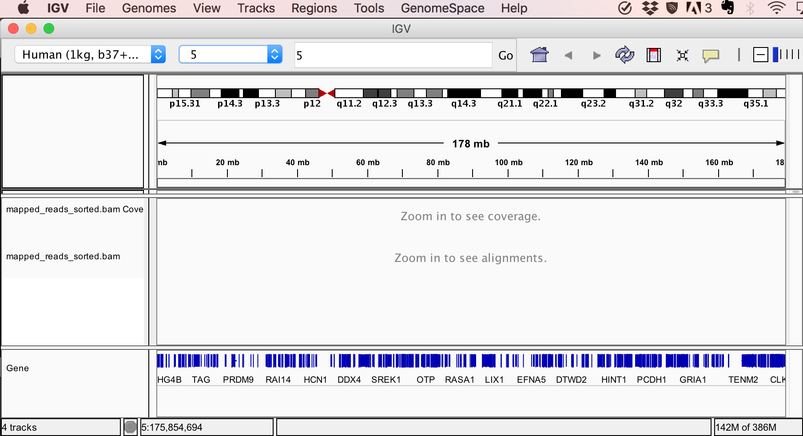

**The material and exercise is made by Tim Hughes at UiO**

#### Get the data

Download the sequence for the human chromosome 5 in verion 37 of the human genome. Download also the paired-end Illumina sequence set in `fastq` format. We will look more into paired fastq sequences and their quality scores later in this course.

```
wget http://folk.uio.no/jonbra/MBV-INF4410_2017/Variant_calling/human_g1k_v37_chr5.fasta.gz .
wget http://folk.uio.no/jonbra/MBV-INF4410_2017/Variant_calling/real_agilentV1_chr5.R1.fastq.gz .
wget http://folk.uio.no/jonbra/MBV-INF4410_2017/Variant_calling/real_agilentV1_chr5.R2.fastq.gz .
```

#### Index the genome (takes a couple of minutes)

```
gunzip human_g1k_v37_chr5.fasta.gz #unzip the file
module load bwa #activate the bwa aligner
bwa index human_g1k_v37_chr5.fasta #takes 2-3 minutes
```

#### Map the reads to the genome

```
# First map the R1 reads
bwa aln human_g1k_v37_chr5.fasta real_agilentV1_chr5.R1.fastq.gz > R1_reads.sai

# Then R2 reads
bwa aln human_g1k_v37_chr5.fasta real_agilentV1_chr5.R2.fastq.gz > R2_reads.sai

# Report the alignment (remember the wildcards?)
bwa sampe human_g1k_v37_chr5.fasta R?_reads.sai real_agilentV1_chr5.R?.fastq.gz > mapped_reads.sam
```

Let's look at the `.sam` file using `head -5 mapped_reads.sam`

```
@SQ	SN:5	LN:180915260
@PG	ID:bwa	PN:bwa	VN:0.7.5a-r405
PCUS-319-EAS487_0001:6:1:38:1703#0	83	5	35861018	60	76M	=	35860943	-151	TGGATCGCAGCACTCACTGACCTGTGCTTTTGAGGACCCAGATGTCAACACCACCAATCTGGAATTTGAAATATGG	@FFDCFDDHHHEFFGEG>DECFHHHGHHEHHGGHHHHHHHHHHHGHFEEDFHDHHHHHHHHHHHFHHHHHHHHHHH	XT:A:U	NM:i:1	SM:i:37	AM:i:37	X0:i:1	X1:i:0	XM:i:1	XO:i:0	XG:i:0	MD:Z:50T25
PCUS-319-EAS487_0001:6:1:38:1703#0	163	5	35860943	60	76M	=	35861018	151	TTCCTCCCCAGGAGACTTGGAAGATGCAGAACTGGATGACTACTCATTCTCATGCTATAGCCAGTTGGAAGTGAAT	HHHHHHHHHHHHHHBHHHHHEFHF@HHBHHFFHHHHHHFHBHHHFFHHFHDHHDHFFHHHHHHHFBFHBFG7DEB@	XT:A:U	NM:i:0	SM:i:37	AM:i:37	X0:i:1	X1:i:0	XM:i:0	XO:i:0	XG:i:0	MD:Z:76
PCUS-319-EAS487_0001:6:1:38:692#0	83	5	35874624	60	76M	=	35874461	-239	CTGTGTGTTATGGAAAAAAAGGTGACCTTCTTCAACTAATAAAGAGGGTGATTGTGTGGGATCACGGACAGTCAGA	G?EFHCHFHDEBHHHHHFFHHEHHHHEDDHFHHHHHHGHHHHHHHHHHGDGHHHHHEGHHHHGHHHHHHHHHHHHH	XT:A:U	NM:i:0	SM:i:37	AM:i:37	X0:i:1	X1:i:0	XM:i:0	XO:i:0	XG:i:0	MD:Z:76
```

```
# We convert the SAM file to a BAM file to save space (notice the file size of the .bam file)
module load samtools
samtools view -bT human_g1k_v37_chr5.fasta mapped_reads.sam > mapped_reads.bam

# We sort the file
samtools sort -O BAM -o mapped_reads_sorted.bam mapped_reads.bam

# And then we index it
samtools index mapped_reads_sorted.bam mapped_reads_sorted.bai
```

Download the sorted bam file and bam index file to your local computer. Download also the tiles used for the exome capture: [http://folk.uio.no/jonbra/MBV-INF4410_2017/Variant_calling/agilent37M.chr5.b37.bed](http://folk.uio.no/jonbra/MBV-INF4410_2017/Variant_calling/agilent37M.chr5.b37.bed) and put it in the same folder.

VI GJØR FRAM TIL HER SAMMEN
## Inspect the mapping in IGV browser
* Start the IGV browser using Java Web Start (like JalView) from [here](http://software.broadinstitute.org/software/igv/download) (Launch with 750 MB).
* Make sure you are using the correct reference, the top left pop down should contain: "Human (1kg, b37+decoy)" 
* Then import the .bam-file: File -> Load from File...
* Go to chromosome 5 in the drop-down menu on top which says "All". Your screen should look something like this:



* Navigate to a specific location on chromosome 5 by pasting into the text box at the top of the window: 5:55,080,012-55,096,132
* Part of a gene model should appear at the bottom of the screen. 
* Now load the tiles that were used to capture the fragments that were sequenced and mapped: File -> Load from File... and select the `agilent37M.chr5.b37.bed` file.
* Notice how the tiles overlap with the exons, and that the mapped reads correspond to the tiles.
* Use the zoomer at the top right of the screen to zoom in a bit more and see how the tiles tend to be a bit larger than the exons
* You can also zoom in by double clicking on the main part of the display
* Navigate to position 5:55,085,643-55,090,501
* Notice how the reads stack up to provide coverage for the targeted regions with coverage tailing off on the edges of tiles.
* Notice to the right of the screen a fragment which was sequenced despite not overlapping with a tile
* Zoom in on the exon that overlaps with tile 1746 by clicking and dragging the region in the ruler at the top of the screen. This should be on the left side of the display if you are at location: 5:55,085,643-55,090,501
* When you are sufficiently zoomed in you will start to see some individual nucleotides in the reads as colours. These are nucleotides in the reads that differ from the reference.
* You will notice a column of differing nucleotides a one position in the exon, this is probably a SNP in the sample.
* Hover with the pointer over the name part of a BAM track and right click >> Select "View as pairs". Notice how fragment size is not constant: some fragments are not fully covered by reads, some pairs of reads read into each other, and some pairs of reads fully overlap.


#### Opening "off the shelf tracks"

* File -> Load from server -> Expand "Annotations" -> Expand "Variation and repeats" -> tick "dbSNP 1.4.7" -> OK. NB: only tick off for dbSNP, if you tick off higher up the tree, IGV will attempt to download all the tracks in the subtree, which will take a long time or will not complete at all.
* You should see a dbSNP track open (in the bottom panel of IGV). Note that you might need to scroll down to see it.
* You can make the gene track less high by hovering over the gene track name >> right click >> select "Collapsed"
* As you see there are many reported SNPs in the dbSNP in the current exon. 


#### Improvement in alignment through refinement

* Paste into the search box:  5:74,021,826-74,021,866
* If you find that you cannot see all the reads on screen, hover with the pointer over the name part of the track >> right click >> select "Collapsed"
* Download a bam-file which contain a alignment of the mapping file we made earlier [here](http://folk.uio.no/jonbra/MBV-INF4410_2017/Variant_calling/aln.posiSrt.withRG.clean.dedup.recal.bam), as well as the [index file](http://folk.uio.no/jonbra/MBV-INF4410_2017/Variant_calling/aln.posiSrt.withRG.clean.dedup.recal.bam.bai)
* Notice how the refined BAM file contains a slightly improved alignment: a read that contained many mismatches in the raw alignment, correctly contains a gap in the refined BAM file and no mismatches (ca. position 5:74,021,836-74,021,866).
* Notice that this deletion is already recorded in dbSNP (see dbSNP track we loaded earlier)


#### Sessions

* Here we want to save the state of the browser so that we can return to it at a later stage or share it with others.
* File -> Save session... -> Give it a name and choose a location -> OK
* When you have successfully completed the above, close down IGV
* Restart IGV as you did at the beginning of the exercise
* File -> Load session... -> Location the session file you just created -> OK
* Magic!! The browser should then reload all tracks and information the way they were when you saved the session.


